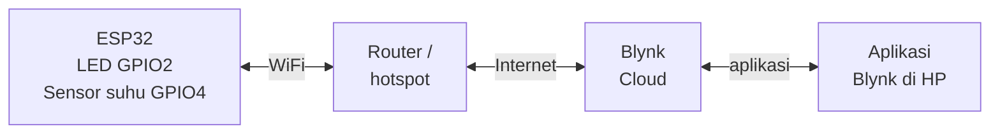

# Block Diagram Versi Blynk

```mermaid
flowchart LR
    ESP["ESP32<br/>LED GPIO2<br/>Sensor suhu GPIO4"] <-->|"WiFi"| RT["Router /<br/>hotspot"]
    RT <-->|"Internet"| BL["Blynk<br/>Cloud"]
    BL <-->|"aplikasi"| APP["Aplikasi<br/>Blynk di HP"]
```

Gambar: `block-diagram-blynk-1.png`.
