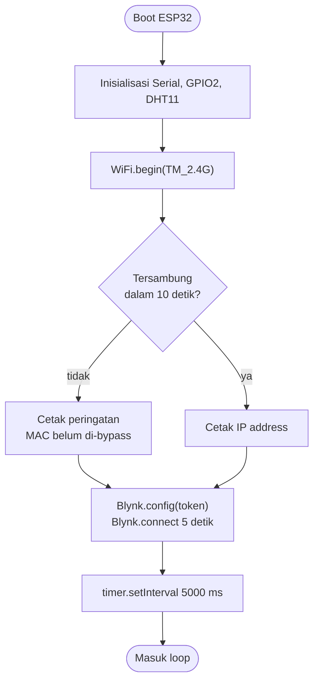
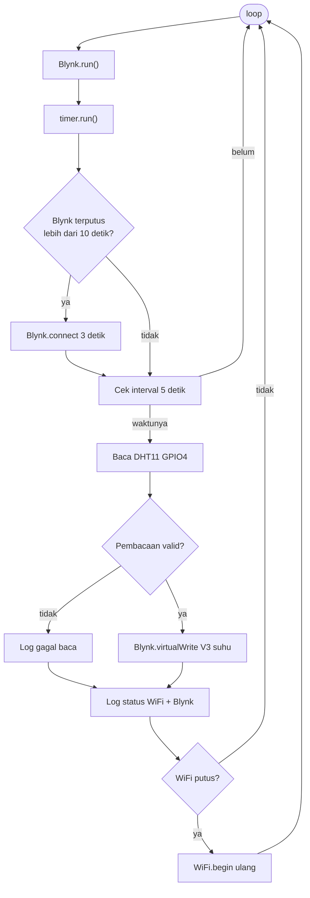
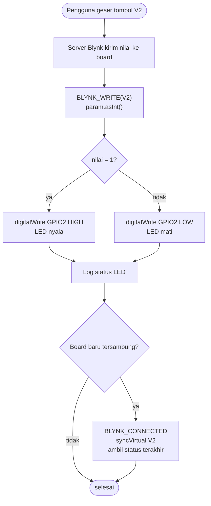

# Flowchart Versi Blynk

## 1. Setup (sekali saat boot)

```mermaid
flowchart TB
    A([Boot ESP32]) --> B["Inisialisasi Serial, GPIO2, DHT11"]
    B --> C["WiFi.begin(TM_2.4G)"]
    C --> D{"Tersambung<br/>dalam 10 detik?"}
    D -- tidak --> E["Cetak peringatan<br/>MAC belum di-bypass"]
    D -- ya --> F["Cetak IP address"]
    E --> G["Blynk.config(token)<br/>Blynk.connect 5 detik"]
    F --> G
    G --> H["timer.setInterval 5000 ms"]
    H --> I([Masuk loop])
```

## 2. Loop utama

```mermaid
flowchart TB
    A([loop]) --> B["Blynk.run()"]
    B --> C["timer.run()"]
    C --> D{"Blynk terputus<br/>lebih dari 10 detik?"}
    D -- ya --> E["Blynk.connect 3 detik"] --> F["Cek interval 5 detik"]
    D -- tidak --> F
    F -- waktunya --> G["Baca DHT11 GPIO4"]
    F -- belum --> A
    G --> H{"Pembacaan valid?"}
    H -- tidak --> I["Log gagal baca"]
    H -- ya --> J["Blynk.virtualWrite V3 suhu"]
    I --> K["Log status WiFi + Blynk"]
    J --> K
    K --> L{"WiFi putus?"}
    L -- ya --> M["WiFi.begin ulang"]
    L -- tidak --> A
    M --> A
```

## 3. Tombol LED di aplikasi

```mermaid
flowchart TB
    A([Pengguna geser tombol V2]) --> B["Server Blynk kirim nilai ke board"]
    B --> C["BLYNK_WRITE(V2)<br/>param.asInt()"]
    C --> D{"nilai = 1?"}
    D -- ya --> E["digitalWrite GPIO2 HIGH<br/>LED nyala"]
    D -- tidak --> F["digitalWrite GPIO2 LOW<br/>LED mati"]
    E --> G["Log status LED"]
    F --> G
    G --> H{"Board baru tersambung?"}
    H -- ya --> I["BLYNK_CONNECTED<br/>syncVirtual V2<br/>ambil status terakhir"]
    H -- tidak --> J([selesai])
    I --> J
```

Gambar: `flowchart-blynk-1.png`, `flowchart-blynk-2.png`, `flowchart-blynk-3.png`.
