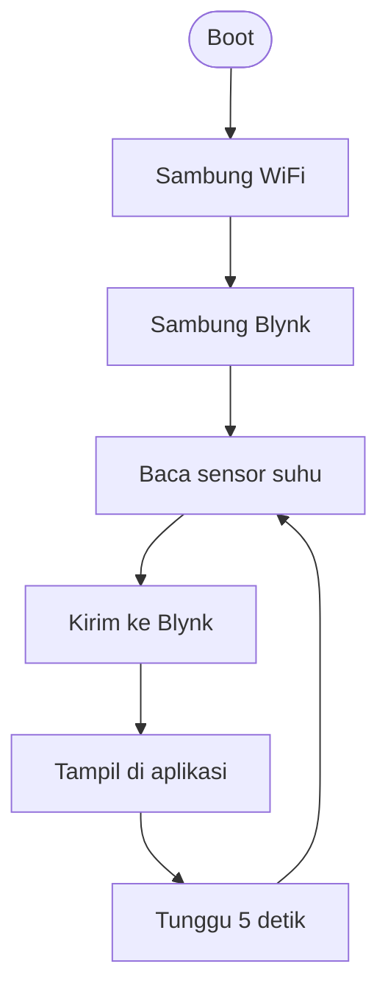
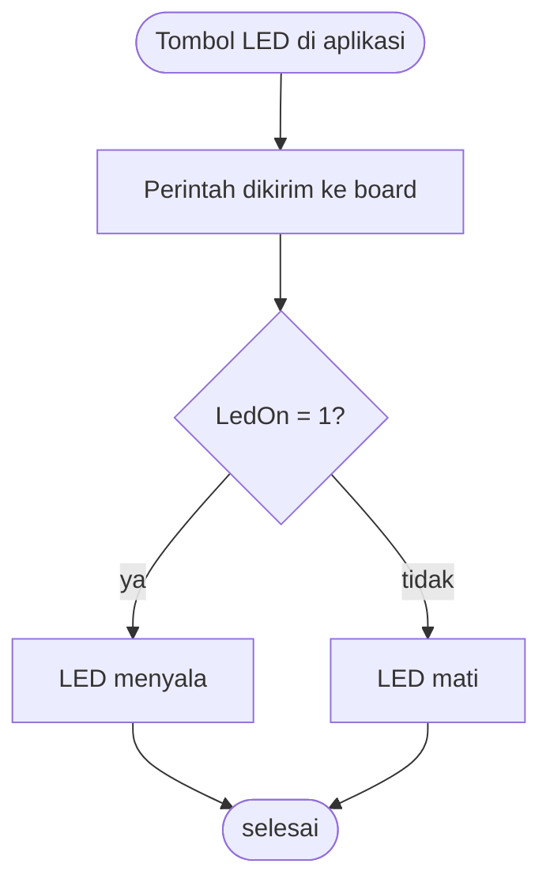

# Flowchart Versi Blynk

## 1. Alur data suhu

```mermaid
flowchart TB
    A([Boot]) --> B[Sambung WiFi]
    B --> C[Sambung Blynk]
    C --> D[Baca sensor suhu]
    D --> E[Kirim ke Blynk]
    E --> F[Tampil di aplikasi]
    F --> G[Tunggu 5 detik]
    G --> D
```

## 2. Alur kontrol LED

```mermaid
flowchart TB
    A([Tombol LED di aplikasi]) --> B[Perintah dikirim ke board]
    B --> C{LedOn = 1?}
    C -- ya --> D[LED menyala]
    C -- tidak --> E[LED mati]
    D --> F([selesai])
    E --> F
```

Gambar: `flowchart-blynk-1.png`, `flowchart-blynk-2.png`.
