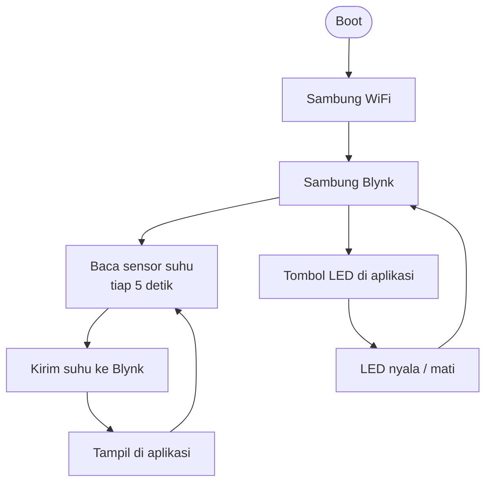

# Flowchart Versi Blynk

```mermaid
flowchart TB
    A([Boot]) --> B[Sambung WiFi]
    B --> C[Sambung Blynk]
    C --> D["Baca sensor suhu<br/>tiap 5 detik"]
    D --> E[Kirim suhu ke Blynk]
    E --> F[Tampil di aplikasi]
    F --> D
    C --> G["Tombol LED di aplikasi"]
    G --> H[LED nyala / mati]
    H --> C
```

Gambar: `flowchart-blynk-1.png`.
